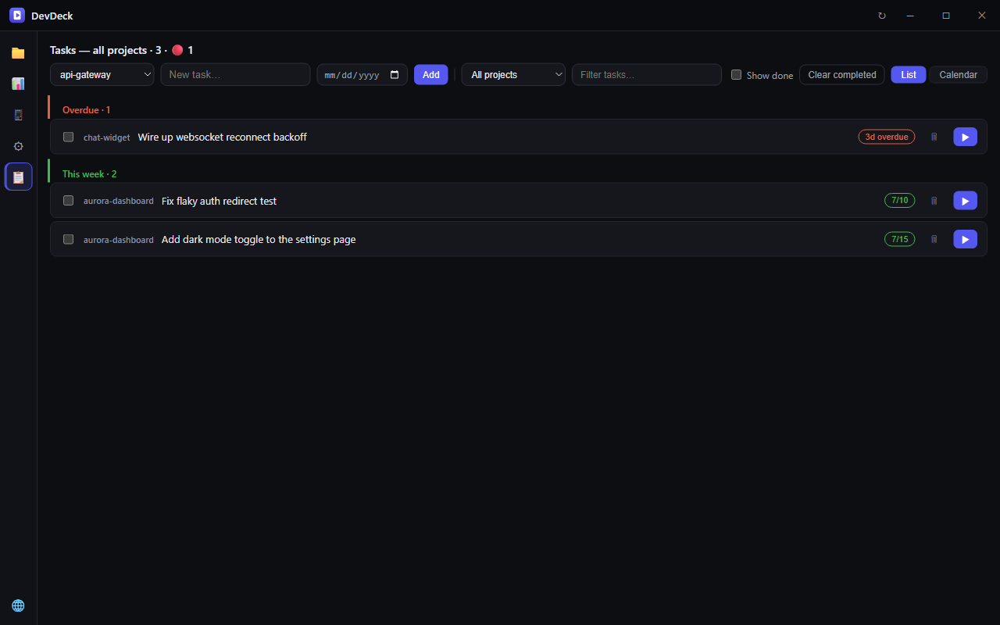
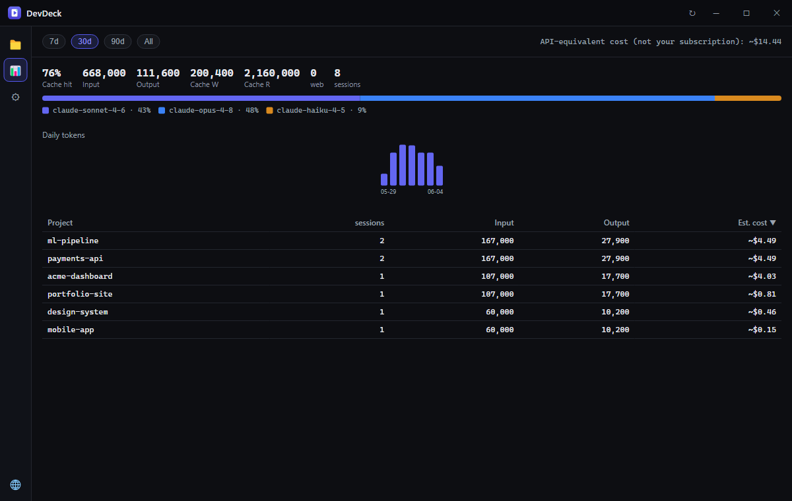

<div align="center">


# DevDeck

**A command deck for everyone juggling a pile of Claude Code & Antigravity projects.**

See every repo's state at a glance — git status, how long it's been neglected, your Claude Code and Antigravity session history — and jump back in with one click (`claude -c` / `agy -c`).


</div>

## Why

If you run Claude Code across a dozen side projects, you lose the thread: *Which repos have uncommitted work? Which have I not touched in weeks? What was I even doing in that one?* DevDeck is a always-on desktop deck that answers those at a glance and gets you back into a session in one click — without touching your code or files.

## Features

- **🗂 Project deck** — every git repo under your scan locations as a card: branch, uncommitted count, last commit, AI session count.
- **➕ New project** — spin up a project without leaving the deck: pick a scan location, name it, and DevDeck creates the folder, runs `git init`, and opens it in a terminal with your active agent.
- **🤖 Multi-agent (Claude Code & Antigravity)** — choose your active agent; the deck shows that agent's sessions and **Open** launches it (`claude -c` / `agy -c`). A toolbar switcher appears when both are installed.
- **📂 Multiple scan locations** — point DevDeck at several folders to scan for repos, or add individual repos that live anywhere; each is auto-detected.
- **🚦 Staleness traffic-light** — fresh / warning / neglected, so dirty or abandoned repos surface themselves.
- **📡 Status pulse** — the toolbar shows live ⚠ needs-you / ◉ working counts across every open cockpit session, plus today's estimated cost; click a count to filter the deck down to just those projects.
- **▶ One-click resume** — opens a terminal in the repo and continues your last session with the active agent (`claude -c` / `agy -c`) — or pick a specific past session.
- **🖥 Cockpit (embedded terminals · Windows)** — on Windows, **Open** drops you straight into an in-app terminal instead of a pile of external windows. A searchable sidebar is **grouped by urgency** — needing-you and working sessions float above a dedicated **📌 pinned** group, with quieter turn/idle sessions below — and carries a count badge on the 🖥 icon (and an optional **tray icon alert**, off-by-default-able) so you can see "who's waiting on me" from any view. Each session shows its **model, active working time, and a per-session 🧠 context % that colors up as it nears the limit**, and you can **name** sessions, **pin** the ones you care about most, and run **several per repo**. The live agent terminal + branch · agent status bar fill the right, with selection **copy (Ctrl+C) / paste (Ctrl+V)** that doesn't clash with the agent's own Ctrl+C interrupt, and clicking an **image path printed in the output** (a screenshot a test just wrote, say) opens it straight in your OS viewer. Running 10+ projects no longer means a wall of shrinking tabs you have to click through to see which finished. Your open sessions are **remembered across restarts** — after a quit or crash the cockpit lists them as one-click **restorable** entries (re-attaching each to its own conversation, pins included). You can run **several sessions in the same repo at once** — a **+ New session** button forks another conversation; each is tracked separately and you can **name it** (double-click the name) so you remember what each one is doing. (macOS/Linux keep opening your external terminal.)
- **↩ Resume cue** — auto-reads the *last thing you asked* in each project's newest session (Claude or Antigravity) and shows it in the note slot, so "where was I?" needs no typing. Click to adopt it as your note.
- **☑ Per-project tasks + deadlines** — every project holds its own checklist with optional due dates; deck cards show a compact `☑ done/total` badge (with an overdue count in red) that jumps straight to the board.
- **📋 "Next" task board** — all open tasks across every project on one board, grouped **overdue / today / this week / later / no date**: check them off, edit inline, set due dates, or add a task to any project without leaving the view. Switch to a **calendar view** to see due dates laid out across the month.
- **↑ Unpushed signal** — commits ahead of your remote, flagged on the card so unprotected work stands out.
- **{ } Open in editor** (VS Code) and **📁 open folder** straight from a card; the deck **auto-refreshes in place** while it's open — only the cards that changed update, so there's no flicker as you work.
- **🐙 Jump to GitHub** — projects with a `github.com` remote show a GitHub icon; click it to open the repo page in your browser.
- **📝 Per-project notes** — jot your next todo; it sticks with the card.
- **📊 Usage analytics** — a **cost-first summary** (est. spend up top), tokens, cache-hit rate, and **active working-time** per project (real focused time, idle gaps excluded), parsed locally from `~/.claude`. **Search projects** in the table and hover the daily chart for per-day tooltips. Deleted projects stay visible (greyed) so totals remain honest.
- **📉 Live limits bar** — when you're signed into Claude Code, a footer meter shows your **5-hour and weekly usage** (%, reset time, plan) so you see a rate-limit coming before it lands.
- **📌 Pin / 🙈 hide / 🔎 search / sort** — keep the deck focused.
- **☰ Card / list view** — toggle a dense list view — a compact status-board grid, one row per project — to scan many repos at a glance; your choice is remembered.
- **🌐 4 languages** — English, 한국어, 日本語, 中文.
- **⬆ Auto-update** — checks GitHub Releases on launch and offers an in-app, user-confirmed download + restart (Windows/Linux; macOS pending code-signing).
- **🚀 Start on Windows login** — optionally launch DevDeck when you sign in (Windows only; opt-in in Settings).
- **🔒 Local-first** — reads your local agent data and git, and the renderer sends nothing anywhere (`connect-src 'none'`). The only outbound calls are to first-party endpoints: the GitHub update check, and — when you're signed into Claude Code — a usage check to `api.anthropic.com` (the same endpoint Claude Code itself uses) for the 5-hour / weekly bar. Your OAuth token stays in the main process and never reaches the renderer; if you're not signed in, no usage call is made. No account, no telemetry.
- System tray + global shortcut (`Ctrl+Alt+D`), frameless Discord-style title bar.

<div align="center">


</div>

## Install

Grab the latest from [**Releases**](https://github.com/writingdeveloper/devdeck/releases/latest):

| OS | Download | First run (unsigned build) |
|----|----------|----------------------------|
| **Windows** | `DevDeck-…-Setup.exe` | SmartScreen → **More info → Run anyway** |
| **macOS** — Apple Silicon | `DevDeck-…-arm64.dmg` | Open once → **System Settings → Privacy & Security → Open Anyway** (see below) |
| **macOS** — Intel | `DevDeck-…-x64.dmg` | Same as above |
| **Linux** | `DevDeck-…-x86_64.AppImage` (portable) or `…-amd64.deb` | `chmod +x` the AppImage, then run |

Builds are **unsigned** (no code-signing certificate yet), so the first launch needs the bypass above. Then open **Settings** and add the folders that hold your git repos — DevDeck scans nothing until you choose them; you can add several scan locations or pin individual repos.

**macOS notes:** on macOS 15 (Sequoia) and later, right-click → Open no longer bypasses Gatekeeper for unsigned apps. Launch the app once (it will be blocked), then go to **System Settings → Privacy & Security** and click **Open Anyway** — macOS may ask you to repeat this once more. Also, the first time you open a project, macOS asks for permission to control **Terminal.app** ("DevDeck wants to control Terminal") — allow it, or opening sessions will silently do nothing. If you denied it, re-enable it under **System Settings → Privacy & Security → Automation**.

## Platform support

| OS | Status |
|----|--------|
| Windows | ✅ Supported — Windows Terminal / PowerShell. Installer provided. |
| macOS | ✅ Supported — opens Terminal.app via `osascript`. `.dmg` provided (arm64 + x64). Launcher logic + AppleScript are validated on real macOS CI runners; GUI hardware-testing & signing still pending — feedback welcome. |
| Linux | ✅ Supported — auto-detects `gnome-terminal` / `konsole` / `alacritty` / `kitty` / `xterm` (and `x-terminal-emulator`). AppImage + `.deb` provided. |

> Every release is built **and** unit-tested on real Windows, macOS, and Linux GitHub Actions runners; the macOS `.dmg` is produced on a genuine Mac runner.

## Build from source

```bash
git clone https://github.com/writingdeveloper/devdeck.git
cd devdeck
npm install
npm start          # build + launch
npm test           # run the test suite (Vitest)
npm run dist       # package to release/win-unpacked  (needs Windows Developer Mode for a clean run)
```

## How it works

DevDeck scans your configured **scan locations** for git repos (walking org/repo layouts, plus any individual repos you add), reads each repo's git state, and cross-references your AI coding sessions — Claude Code (`~/.claude/projects`) or Antigravity (`~/.gemini/antigravity`). Everything runs in the Electron main process and stays on your machine — DevDeck only *reads* your data and *launches* a terminal; it never edits your project files. New agents plug in behind one `AgentProvider` interface.

**Tech:** Electron 43 · TypeScript · esbuild · Vitest · electron-updater. Hardened renderer (context isolation, sandbox, strict CSP).

## Contributing

Issues and PRs welcome — especially **code-signing** (Windows/macOS), the top roadmap item: it removes the SmartScreen/Gatekeeper friction and unlocks macOS auto-update. This is an early project; expect rough edges.

## License

[MIT](LICENSE) © Si Hyeong Lee
