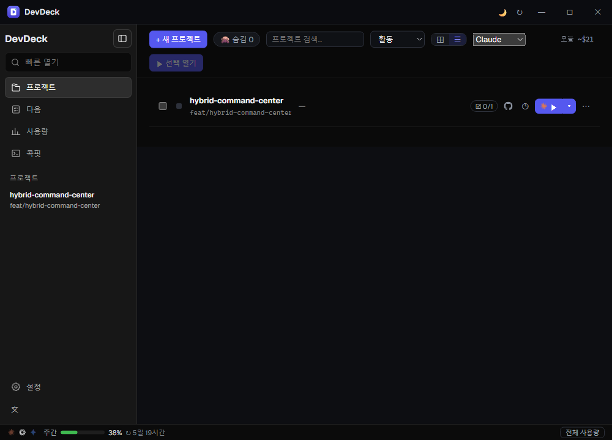
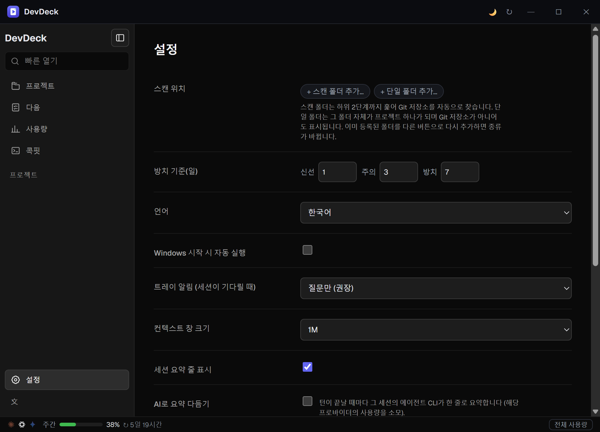

<div align="center">


# DevDeck

**A local-first command center for Claude Code, Codex, and Antigravity projects.**

See every repository, live agent session, next task, local usage estimate, and resume cue in one stable workspace.


</div>

## What DevDeck solves

AI coding work gets fragmented quickly: one repository is waiting for a response, another has uncommitted work, and a third has a conversation you meant to resume. DevDeck keeps those contexts together without uploading your project or transcript data.

The interface is organized as one command center:

- The sidebar contains Quick Open, primary views, urgency-grouped live sessions, and compact projects. Drag its edge to any width between 180 and 460px; the choice is remembered.
- The sidebar collapses to 52px on desktop and becomes a Sessions/Needs You drawer at narrow widths.
- The main project overview defaults to a row-first status board with localized text-and-shape status; cards remain optional.
- Selecting a session focuses its existing embedded terminal without respawning or remounting it.
- Project Memory opens as a right-side drawer, or a full-width sheet on narrow windows.

<div align="center">

</div>

## Highlights

- **Unified project and session navigation** — Needs You and Working sessions stay visible from Projects, Tasks, Usage, and Settings. Previous sessions expose restore, warning, pin, forget, and Restore All actions in the same shell. Quick Open (`Ctrl+Shift+P`, reachable from inside a terminal) filters both sessions and projects.
- **Built for long lists** — every group orders by last activity, folds to a counted header, and caps itself with a "show more"; the project list shows your recent repositories with the rest one click away. Unpinning names the group it moved the session to and offers an undo.
- **Row-first project overview** — resume cues lead each row; branch, working-tree state, providers, sessions, cost, tasks, GitHub, editor, folder, and provider-aware Open remain available.
- **Provider-aware Open** — focus a live session, continue the correct provider-owned conversation, start a fresh session, or explicitly choose another installed provider.
- **Cockpit on Windows** — embedded Claude Code, Codex, and Antigravity terminals with persistence, restart, fork, rename, pin, close confirmation, search, clipboard handling, clickable links and image paths, context percentage, and summaries.
- **External terminals on macOS and Linux** — the same project actions launch supported native terminal applications.
- **Work on another machine (DevDeck Link)** — pair two DevDecks and drive one from the other: switch the deck to that machine, open one of its projects, and its agent runs there while you type here. Terminal text travels instead of a screen, so the remote machine's GPU is untouched. See [Working across machines](#working-across-machines).
- **Project Memory** — an on-demand local snapshot of the latest conversation, Git state, recent commits, tasks, notes, and activity timeline. It makes no AI or network call.
- **Cross-project Tasks** — add, edit, complete, schedule, filter, and view tasks as a list or calendar.
- **Local usage analytics** — combined Claude Code and Codex token and API-equivalent cost estimates, provider filters, model/day/project breakdowns, and deleted-project history.
- **Live provider limits** — a fixed 26px footer summarizes the most urgent supported limit; the dialog keeps each provider independent and preserves last-good data.
- **Repository signals** — uncommitted files, unpushed commits, staleness, session history, resume cues, notes, pin/hide, GitHub, editor, and folder actions.
- **Four languages** — English, 한국어, 日本語, 中文.
- **Local-first security** — context isolation, sandboxing, strict CSP, no telemetry, and no project data sent by the renderer. Machine-to-machine connections are opt-in, direct, and mutually authenticated; there is no relay server.

<div align="center">


<br />


<br />

</div>

## Install

Download the latest build from [Releases](https://github.com/writingdeveloper/devdeck/releases/latest).

| OS | Download | First run |
|---|---|---|
| Windows | `DevDeck-…-Setup.exe` | SmartScreen → More info → Run anyway |
| macOS Apple Silicon | `DevDeck-…-arm64.dmg` | Privacy & Security → Open Anyway |
| macOS Intel | `DevDeck-…-x64.dmg` | Privacy & Security → Open Anyway |
| Linux | `…-x86_64.AppImage` or `…-amd64.deb` | `chmod +x` for AppImage |

Builds are currently unsigned. After launch, open Settings and add scan roots or individual project folders; DevDeck scans nothing until you choose them.

On macOS, allow Terminal automation when prompted. On macOS 15 or later, launch once and use System Settings → Privacy & Security → Open Anyway for the unsigned build.

## Platform support

| OS | Project actions | Embedded Cockpit | As a Link host | As a Link viewer |
|---|---|---|---|---|
| Windows | Windows Terminal / PowerShell | Yes | Yes | Yes |
| macOS | Terminal.app through `osascript` | No | No | Yes |
| Linux | Auto-detected supported terminal | No | No | Yes |

The embedded terminal needs a pty, which DevDeck currently has on Windows only — so a machine can *host* sessions on Windows. A viewer needs no pty at all, because the terminal it is driving runs on the host: a macOS or Linux DevDeck can open and use a Windows machine's sessions.

Every release is built and unit-tested on Windows, macOS, and Linux CI runners.

The command-center UI is also exercised in Electron at desktop and 520px widths across all four languages, followed by automated accessibility audits.

## Working across machines

DevDeck Link connects two DevDeck installs so one can open and drive the other's sessions. It exists
because the alternative — screen sharing — ships an entire desktop as video to move what is really
just terminal text, which pins the remote machine's GPU exactly when you need it for something else.

### Pairing

1. On the machine whose projects you want to reach: **Settings → Machines → Create a connection code**.
2. Copy it, and paste it on the other machine's Settings → Machines.

That is the whole flow. The code carries the host's addresses, port and certificate fingerprint, so
there is nothing to type — and if the code is already in your clipboard, the second machine offers it
as a single click. If the two machines cannot share a clipboard, moving the code across once by
whatever means you already have is enough; it is never needed again.

### Reaching the other machine

The transport is a plain TCP connection, so **no particular network product is required**. All of
these work the same way, and DevDeck cannot tell them apart:

| Situation | What the host advertises |
|---|---|
| Same network | `192.168.1.69:47820`, and the machine's own name |
| Different places, over an overlay network (Tailscale, WireGuard, …) | the overlay address, e.g. `100.96.248.54:47820` |
| No VPN, no relay | `ssh -N -L 47820:127.0.0.1:47820 desktop`, then `127.0.0.1:47820` |

The host enumerates its own reachable addresses and puts them all in the code; the viewer tries them
in order and remembers whichever answered, so a laptop that moves between home and the office
reconnects without anyone changing a setting.

One honest caveat about names: Windows does not run an mDNS responder, so `HOST.local` reaches a
Windows host only if something (Bonjour, usually installed by other software) provides one. If you
want a name that keeps working after the machine's IP changes, an overlay network or a DHCP
reservation is the answer — not mDNS.

### What it does and does not do

- **No relay server exists.** Your machines talk directly to each other; nothing passes through
  infrastructure operated by this project, because there is none.
- **Accepting connections is off until you turn it on.** Your firewall will ask once.
- The connection is **mutually authenticated TLS 1.3**. Each machine has a self-signed certificate
  generated on first run, and each pins the other's fingerprint — which travels inside the connection
  code, so a machine is pinned from the very first connection rather than trusted on faith. A machine
  that answers but is not the one you paired with is refused and never silently retried.
- Access is **per device and revocable**: see the deck, type in sessions, start sessions, edit notes.
  Shutting the host down is a separate permission and is off by default. Revoking takes effect on the
  live connection, not the next one.
- Two things can never be done remotely, whatever permissions a device holds: **adding a scan folder**
  (that requires the native picker on the machine itself) and **starting a provider login** (that
  belongs in front of the machine holding the credentials). Credentials themselves never leave a
  machine; only computed usage numbers do.
- Every connection, refusal and denied call is recorded in **Settings → Machines → Connection history**.
- While a viewer is attached, the host will not idle-shut-down or sleep.

Not yet supported across machines: opening a remote file or folder in a local application.

## Build from source

```bash
git clone https://github.com/writingdeveloper/devdeck.git
cd devdeck
npm install
npm start
```

Useful checks:

```bash
npm test
npm run build
npm run qa
npm run qa:audit
npm run qa:resilience
```

CI runs the multilingual journeys and failure/recovery checks as well as unit tests and accessibility audits.
Tagged releases wait for those checks and all OS builds, then exercise the packaged Windows app before publication.
See the [quality review and regression-testing guide](docs/quality-review-1.37.6.md) for coverage and remaining risks.

## How it works

DevDeck scans only the folders you authorize, reads Git state, and correlates local session data from:

- Claude Code: `~/.claude/projects`
- Codex: `~/.codex/sessions`
- Antigravity: `~/.gemini/antigravity`

Project scanning, transcript parsing, Git calls, terminal processes, and provider usage checks stay in the Electron main process. The sandboxed renderer receives normalized view models through guarded IPC. New agents plug in behind the existing provider interface.

Outbound traffic is limited to first-party update or supported usage endpoints. DevDeck has no account system and no telemetry. Codex credentials are never read by DevDeck; its official app server owns its authentication.

## Tech

Electron 43 · TypeScript · esbuild · Vitest · Playwright · axe-core · electron-updater

## Contributing

Issues and pull requests are welcome. Code signing for Windows and macOS remains a priority because it removes first-run security friction and enables a smoother release path.

## License

[MIT](LICENSE) © Si Hyeong Lee
